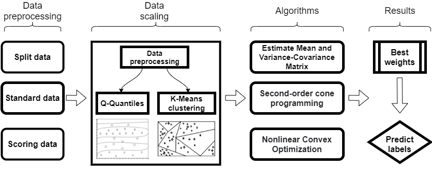

# Stochastic sigmoid logistic regression

## SLR


## INSTALLATION
- sklearn 
- numpy  
- cvxopt
- pandas
- Run on command:
    ```python
    pip install -r requirements.txt
## DATASETS
Download datasets : [Link](https://drive.google.com/file/d/1vlF2FGzOncIt8bJS5Zh6WonkyHtBzDIv/view?usp=sharing)

## TRAINING
- K-Means clustering algorithm:
    ```python
    python test.py --state train --path_data <path to dataset> --n_clus <number of cluters> --alpha <alpha> --option Kmean --threshold <not default>
- Approximate q-quantiles algorithm:
    ```python
    python test.py --state train --path_data <path to dataset> --n_clus <number of cluters> --alpha <alpha> --option Quantile --threshold <not default>

## EVALUATION
- Evaluate accuracy, f1 score, precision score, recall socre with number of clusters (level-quantiles) and time training:
    ```python
    python test.py --state eval --path_data <path to dataset> --alpha <alpha> --min_iters <start iter> --max_iters <end iter>
- Beside, we also provide custom procedure for evaluating accuracy, f1 score, precision score, recall socre with alpha in file `model.py`. That is 
    ```python
    def weight_eval_alpha() 

## ISSUES
- Data in together group K-Mean (level-quantiles) is a element. You'll see this Warning, to disable that Warning you can add `-W ignore` before `function.py`  
    
## RESULTS
- Framingham Heart Disease datasets  
    
    
    
    
- German Credit datasets
    
    
    
    
## TIME TRAINING
- Framingham Heart Disease datasets  
    
- German Credit datasets
    
## NOTE
If you don't select threshold, output model is accuracy of original logistic regression which is provided by sklearn library
```python
python test.py --state train --path_data <path to dataset> --n_clus <number of cluters> --alpha <alpha> --option Kmean(or Quantile) 

